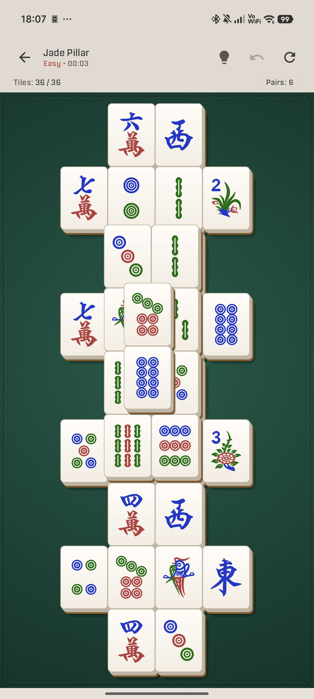
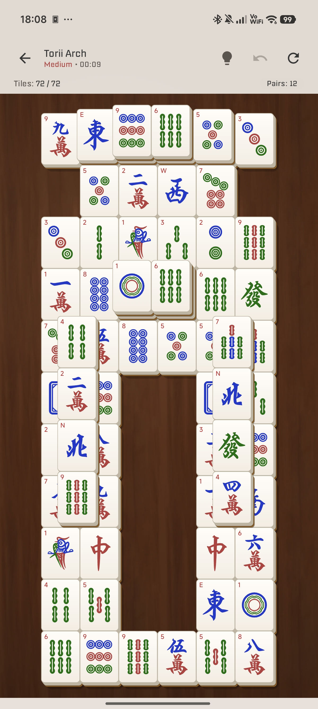

# Mahjong Solitaire

[](LICENSE)
[](https://developer.android.com)
[](https://ko-fi.com/pcmciakai)

Classic Mahjong Solitaire designed for a smooth, clean experience on low-performance phones and tablets. No ads, no interruptions.

## Features

- **Guaranteed Solvable Boards:** Every generated game features a verified path to completion.
- **Multiple Constellation Layouts:** Includes phone-optimized compact layouts as well as classic full-board constellations suitable for larger displays and tablets.
- **Smooth Interaction & Canvas Rendering:** Optimized tile rendering engine with dynamic scaling and depth effects.
- **Interactive Tutorial:** A guided tutorial level that teaches new players how the game works.
- **Player Tools:** Unlimited hints, undo, reshuffling, and optional highlighting for playable tiles.
- **Audio & Haptics:** Tactile tile collision sounds, ambient background music, and subtle haptic feedback (can be toggled in settings).
- **Auto-Save:** Progress is saved automatically on state change.

## Screenshots

<p align="center">
  
  
</p>

## Requirements

- Android 11 (API 30) or newer

## Building

The project uses Gradle with the included wrapper and requires JDK 17 or newer.

```sh
# Debug build
./gradlew assembleDebug

# Release build (unsigned)
./gradlew assembleRelease

# Run unit tests
./gradlew test
```

The APK is written to `app/build/outputs/apk/`.

## AI Disclosure

The majority of this project's source code was written with the help of AI tools. Because the code is largely AI-generated, it builds on the collective work of countless developers who share their knowledge openly — and it should give back in the same way. For this reason, this project is and must always remain open source.

The background music tracks were generated with AI ([Suno](https://suno.com), free plan) and are not human-composed.

## License & Asset Attributions

This project is open source under a multi-license structure:

- **Source Code:** [GNU General Public License v3.0 (GPLv3)](LICENSE) with [App Store Exception](NOTICE.md#app-store-exception-additional-permission-under-gplv3-section-7)
- **Tile Graphics:** [samoheen/mahjong-tiles](https://github.com/samoheen/mahjong-tiles) — Dedicated to Public Domain (CC0 1.0)
- **Sound Effects:** [Mahjong Sound Pack by T-STUDIO](https://t-studio-tst.itch.io/free-sound-mahjong-sound-pack) — Used with attribution (`みんなの創作支援サイトＴスタ`)
- **Background Music:** AI-generated with [Suno](https://suno.com) (free plan)
- **Typography:** [Tomorrow](https://fonts.google.com/specimen/Tomorrow) by Tony de Marco & Monica Rizzolli — [SIL Open Font License 1.1](LICENSES/OFL-1.1-Tomorrow.txt)

See [LICENSE](LICENSE) for the full license text and [NOTICE.md](NOTICE.md) for details on the exception and asset attributions.
